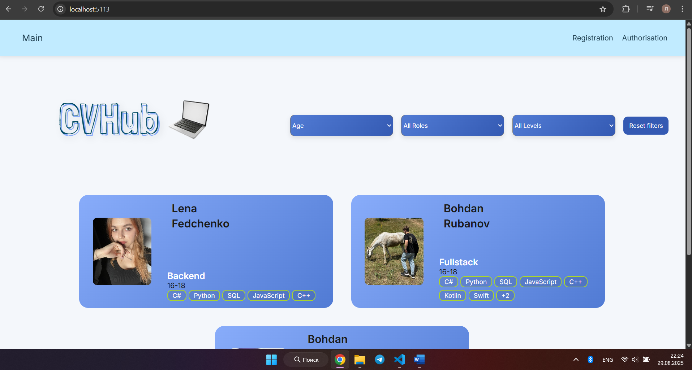
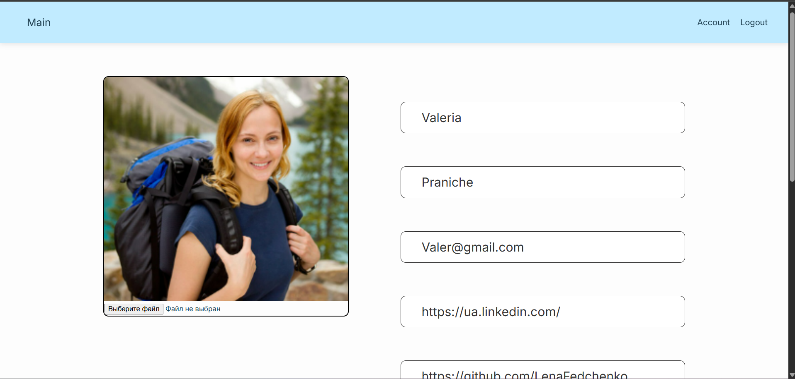

# CVHub


---

## 🇺🇦 CVHub  

### Опис  
**CVHub** — це вебзастосунок, що допомагає знаходити розробників та переглядати їхні резюме. Система дозволяє створювати акаунти, редагувати інформацію про себе, додавати навички, а також переглядати профілі інших користувачів.  

---

## 🇬🇧 CVHub  

### Description  
**CVHub** is a web application designed to help users find developers and explore their CVs. The platform allows users to create accounts, edit personal information, add skills, and browse other developers’ profiles.  

---

## 🚀 Основні можливості / Key Features
- 🔑 Реєстрація та авторизація / User registration and authentication  
- 👤 Профіль з навичками та ролями / Profile creation with skills and roles  
- 🔍 Пошук та фільтрація / Search and filtering  
- 📄 Перегляд резюме / CV viewing  
- 💾 Збереження в базі даних / Database storage  
- 🧪 Юніт-тести для надійності / Unit tests for reliability  

---

## 🖼️ Preview / Screenshots  
 
Main page
  

Account
  

---

## ⚙️ Технології / Technologies  
- **Backend:** ASP.NET Core, Entity Framework Core  
- **Frontend:** Razor Pages, HTML, CSS, JavaScript  
- **Database:** Microsoft SQL Server / SQLite  
- **Other:** Session, Logging, Unit Tests  

---

## 📂 Архітектура / Architecture  

```plaintext
CVHub
├── Controllers      # Логіка запитів / Request handling
├── Models           # Моделі даних / Data models
├── Views            # Razor Pages (UI)
├── wwwroot          # CSS, JS, static files
└── Data             # Контекст бази даних / Database context
